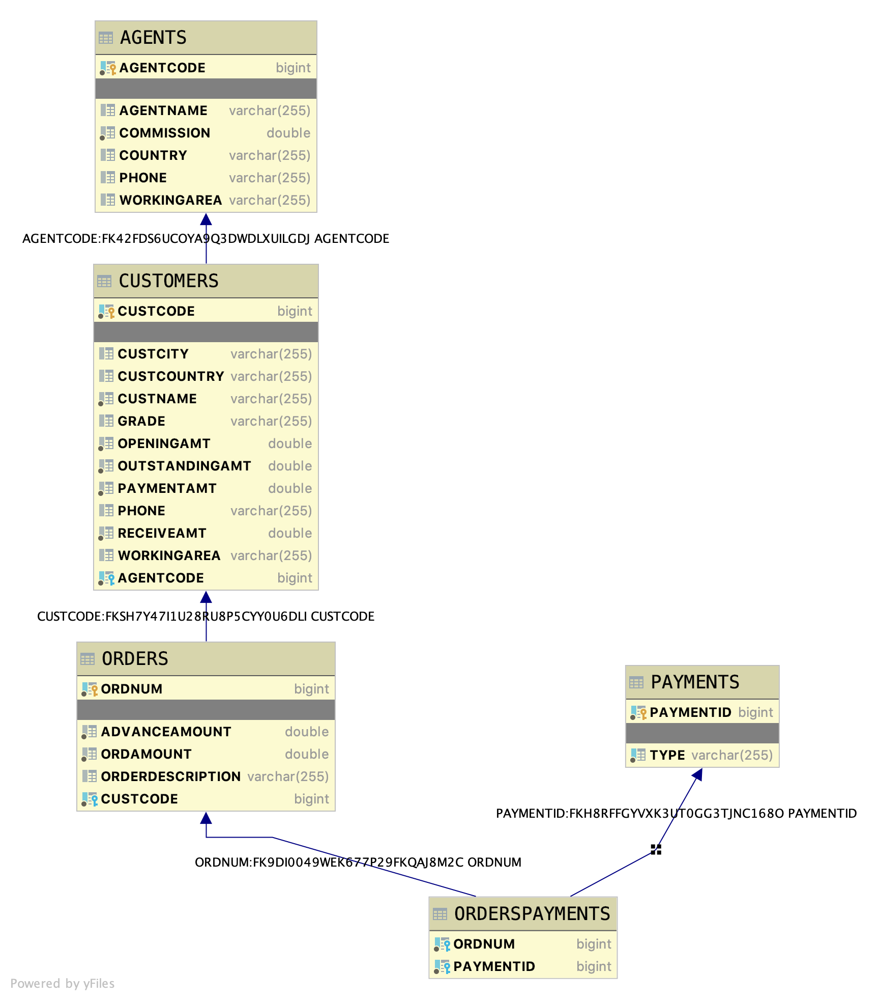

# Java Modeling Orders

A student that completes this project shows that they can:

* perform CRUD operations on an RDBMS using JPA and Hibernate (data modeling)
* implement seed data using SQL statements
* explain and use Spring Data Relationships
* implement a data seeding class using JPA and Hibernate
* use H2 Console and H2 IntelliJ integration to explore data

## Introduction

This is a basic database scheme with customers, orders, and sales agents. This Java Spring REST API application will
provide the data modeling to support the application. This is part 1 of a 3 part application series.

### Database layout

The table layouts are as follows

* AGENTS
    * AGENTCODE primary key, not null Long
    * AGENTNAME string
    * WORKINGAREA string
    * COMMISSION double
    * PHONE string
    * COUNTRY string

* CUSTOMERS
    * CUSTCODE primary key, not null Long
    * CUSTNAME String, not null
    * CUSTCITY String
    * WORKINGAREA String
    * CUSTCOUNTRY String
    * GRADE String
    * OPENINGAMT double
    * RECEIVEAMT double
    * PAYMENTAMT double
    * OUTSTANDINGAMT double
    * PHONE String
    * AGENTCODE Long foreign key (one agent to many customers) not null

* ORDERS
    * ORDNUM primary key, not null Long
    * ORDAMOUNT double
    * ADVANCEAMOUNT double
    * CUSTCODE Long foreign key (one customer to many orders) not null
    * ORDERDESCRIPTION String

* PAYMENTS
    * PAYMENTID primary key, not null long
    * TYPE String not null

* ORDERSPAYMENTS (join table)
    * ORDERNUM foreign key to ORDERS
    * PAYMENTID foreign key to PAYMENTS.

* Customers has a foreign key to Agents (AGENTCODE) this means:
    * Customers has a Many to One relationship to Agents and
    * Agents has a One to Many relationship to Customers

* Orders has a foreign key to Customers (CUSTCODE)
    * Orders has a Many to One relationship to Customers and
    * Customers has a One to Many relationship to Orders

* Orders has a many to many relationship with payments
    * multiple orders can use the same payment type and an order can have multiple payment types.
    * For example, you can use both gift card and credit card to pay for an order.

### MVP and Stretch Goal

The database will be available from the H2 Console. Each table will contain the appropriate data.

## Instructions

* [ ] Please fork and clone this repository. This repository does not have a starter project, so create one inside of
  the cloned repository folder. Regularly commit and push your code as appropriate.

### MVP

* [ ] Create the entities needed to store this data.
* [ ] Seed the database
    * [ ] A data.sql file has been provided with seed data. You can use this class directly or modify it to fit your
      models. However, the data found in the file is the seed data to use!
    * [ ] A SeedData.java file has been provided seed data. You can use this class directly or modify it to fit your
      models. However, the data found in the file is the seed data to use!
    * [ ] Your application should be able to easily switch between seeding with the data.sql data or the data from
      SeedData.java.

### Stretch Goal

* [ ] Implement Javafaker
    * [ ] Create around 100 new customers
    * [ ] Randomize as much of the data as possible
    * [ ] You can assign all new customers to the same agent
    * [ ] Randomly assign 0 - 10 orders to each customer
        * [ ] Randomize as much of the data as possible
        * [ ] All orders can be of the same payment type